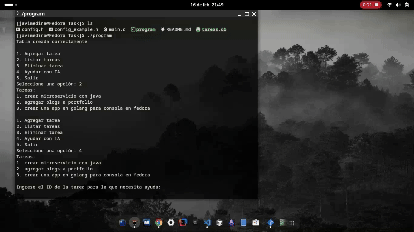

# Task Management System

This is a simple task management system written in C. It allows you to add, list, delete tasks, and get AI assistance for tasks using SQLite for database management and CURL for API requests.

## Demo


## Features

- Add tasks
- List tasks
- Delete tasks
- Get AI assistance for tasks

## Requirements

- SQLite3
- libcurl
- json-c

## Setup

1. Install the required libraries:
    ```sh
    sudo apt-get or dnf install libsqlite3-dev libcurl4-openssl-dev libjson-c-dev
    ```

2. Compile the project:
    ```sh
    gcc main.c -o task_manager -lsqlite3 -lcurl -ljson-c
    ```

## Usage
Add your openai key

Run the compiled program:
```sh
./task_manager
```


Follow the on-screen instructions to manage your task
